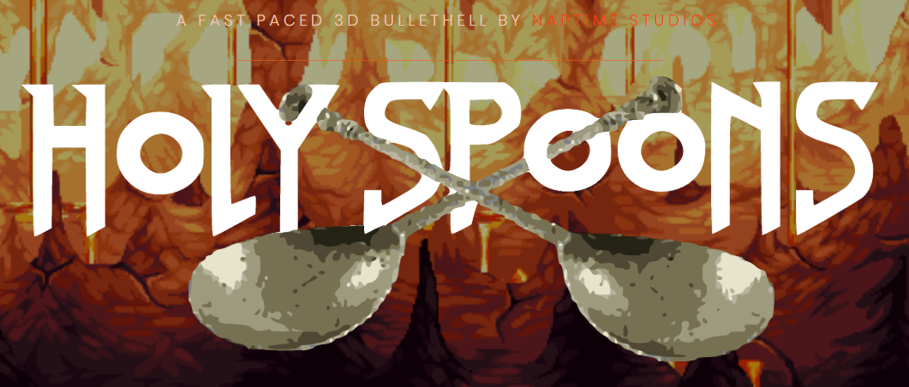
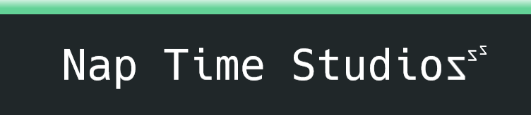
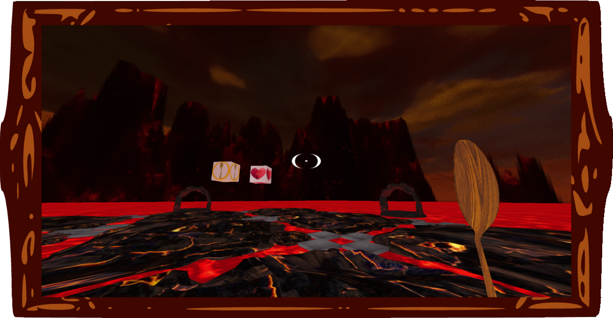
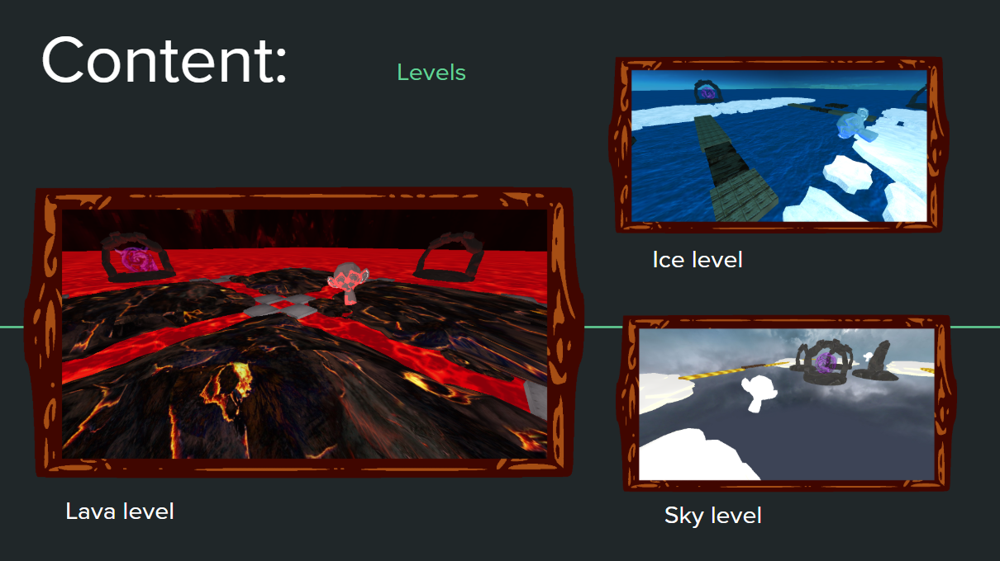
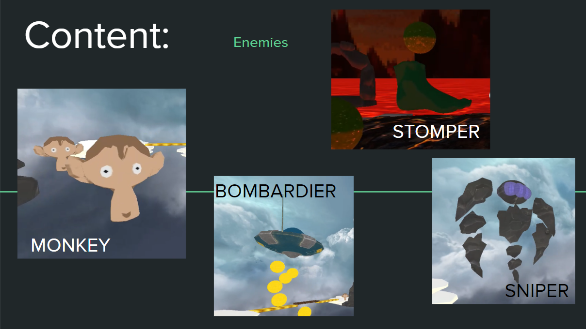
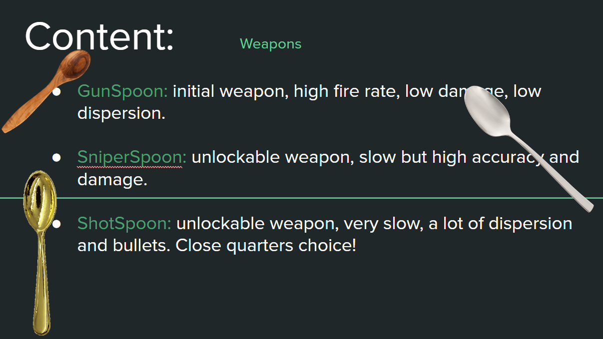
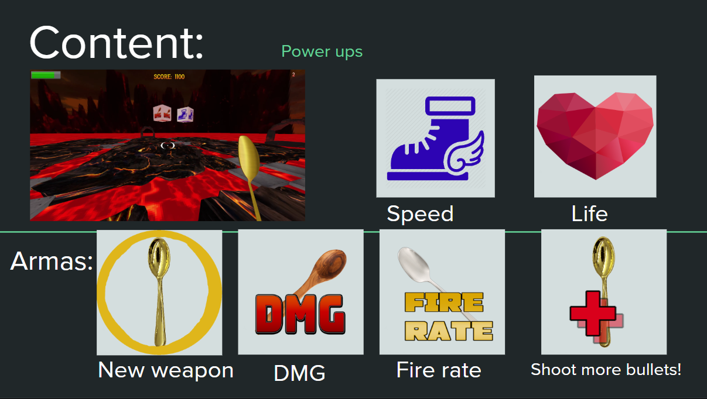
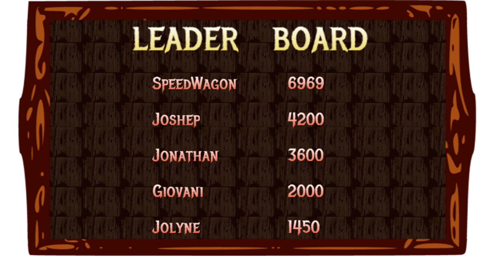

# **Holy Spoons** | [*web*](https://dimateos.github.io/Holy_Spoons/) | [*video*](https://www.youtube.com/watch?v=IQfUdBuVHcc) | [*download*](https://mega.nz/#!41AlQS7I!-GBgQ_hPpN0wz3wzfsZMJC6KHxTzsjtobD_sylzSjn8)

[](https://dimateos.github.io/Holy_Spoons/)

## Please go ahead and check out:
* Our awesome [*web*](https://dimateos.github.io/Holy_Spoons/)!
* Our epic [*video*](https://www.youtube.com/watch?v=IQfUdBuVHcc) (Gameplay Reveal):
* Download the last [*build*](https://mega.nz/#!41AlQS7I!-GBgQ_hPpN0wz3wzfsZMJC6KHxTzsjtobD_sylzSjn8)

# NapTime Studios
> *Done for the P3 (Project 3) subject during our third year at [UCM Madrid](https://informatica.ucm.es/) (university)*



* Diego Baratto - [DiegoBV](https://github.com/DiegoBV) `dbaratto@ucm.es`
* Juan Barea - [JuBarea](https://github.com/JuBarea) `​jubarea@ucm.es`
* Lluis Cañellas - [LluisCS](https://github.com/LluisCS) `​​lluiscan@ucm.es`
* Diego Mateos - [dimateos](https://github.com/dimateos) `dimateos@ucm.es`
* Jorge Rodríguez - [jorgerodrigar](https://github.com/jorgerodrigar) `jorger09@ucm.es`
* Gonzalo Sanz - [gonzsa04](https://github.com/gonzsa04) `gonzsa04@ucm.es`

## Dependencies *(made with)*
* [NVIDIA PhysX SDK 4.0](https://github.com/NVIDIAGameWorks/PhysX)
* [Ogre3D](https://www.ogre3d.org/)
* [Irrklang](https://www.ambiera.com/irrklang/)
* [JSON for Modern C++](https://nlohmann.github.io/json/)


## Gameplay
> *A fast paced 3d bullethell with mokeys*

Holy Spoons is a fast-paced arena shooter in which you'll have to survive endless rounds of challenging enemies to achive a high score and save the world. Featuring 3 diferent worlds with several different enemies and champions variations and a Rogue-like upgrade system.



### Levels


### Enemies


### Guns


### Power Ups


### Leader board
> sweet jojoffline leaderboard (name wrote at `/user/config.json`)
>



## Controls

You can edit them + some options at `/user/config.json`

```json
{
  "name": "Paco",

  "controls": [
    { "FORWARD": "w" },		#movement
    { "BACKWARD": "s" },
    { "LEFT": "a" },
    { "RIGHT": "d" },

    { "FIRST": "1" },		#weapons
    { "SECOND": "2" },
    { "THIRD": "3" },

    { "PAUSE": "p" },		#actions
    { "JUMP": "space" },
    { "RUN": "shift" }
  ],

  "camera": [
    { "cam_fovY": 90.00 },	#sens + shoot w/ left mouse
    { "cam_sensX": 1.25 },
    { "cam_sensY": 1.25 }
  ],

  "holding": [
    { "hold_zoom": true },	#toggling options
    { "hold_sprint": true }
  ],

  "sound": [
    { "sound_music": 1.0 },	#audio (actually not implemented in the end)
    { "sound_sfx": 1.0 }
  ],

  "appConfigPath": "./Assets/globalCFG.json" #dev stuff
}

```

## Documentation  ***(in Spanish)***

At `/hitos` you can check all the pdf documents and our milestones presentations we had to make.

* You also got architecture, design and pitch docs, etc...
